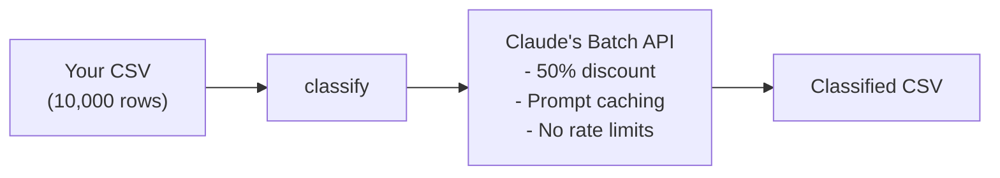

# classify

<div class="hero" markdown>
  <p class="hero-tagline">Classify thousands of CSV rows with Claude's Batch API</p>
  <p class="hero-subtitle">Pay <strong>50% less</strong>, get results in ~1 hour, no rate limits</p>
  <p class="hero-cta">
    <a href="usage/#quick-start" class="md-button md-button--primary">Get Started</a>
    <a href="https://github.com/alfranz/classify" class="md-button">GitHub</a>
  </p>
</div>

<style>
.hero {
  text-align: center;
  padding: 2rem 0 3rem 0;
}
.hero-tagline {
  font-size: 1.5rem;
  font-weight: 300;
  color: var(--md-primary-fg-color);
  margin-bottom: 0.5rem;
}
.hero-subtitle {
  font-size: 1.1rem;
  color: var(--md-default-fg-color--light);
  margin-bottom: 2rem;
}
.hero-cta {
  display: flex;
  gap: 1rem;
  justify-content: center;
  flex-wrap: wrap;
}
</style>

## Overview

Stop writing loops to classify data. `classify` turns CSV classification into a single command, handles batching automatically, and gives you prompt caching for free.



## Features

<div class="grid cards" markdown>

-   :material-rocket-launch:{ .lg .middle } **Automatic Batching**

    ---

    Point at your CSV, get classified data back. No manual batch management needed.

-   :material-format-list-bulleted:{ .lg .middle } **Structured Outputs**

    ---

    Define your schema, get valid JSON every time with Pydantic validation.

-   :material-cached:{ .lg .middle } **Prompt Caching**

    ---

    System prompt cached across all rows for 90% cost reduction on cache hits.

-   :material-currency-usd:{ .lg .middle } **50% Batch Discount**

    ---

    Automatically applied to all tokens. Pay half the price of regular API calls.

-   :material-calculator:{ .lg .middle } **Cost Estimation**

    ---

    See exact costs before submitting your batch job.

-   :material-brain:{ .lg .middle } **Reasoning Support**

    ---

    Get explanations for each classification to improve accuracy and debugging.

</div>

## Installation

Requires Python 3.12+

```bash
# Install as an isolated tool (recommended)
uv tool install git+https://github.com/alfranz/classify.git

# Or run without installing
uvx --from git+https://github.com/alfranz/classify.git classify --help
```

Set your API key:

```bash
export ANTHROPIC_API_KEY=your_api_key_here
```

## Quick Start

Try the included example:

```bash
# Check the example and see cost estimate
classify check examples/example_config.yaml

# Submit the batch (costs ~$0.02)
classify run examples/example_config.yaml

# Check status (processing takes ~30-60 minutes)
classify status <batch_id>

# Download and merge results when done
classify pull <batch_id>
```

## Why Batch API?

You have a CSV with 10,000 rows. Each needs classification. You could:

| Approach | Cost | Time | Rate Limits |
|----------|------|------|-------------|
| Loop through rows | Full price | ~3 hours | Hit limits |
| **Batch API** | **50% less** | **~1 hour** | **None** |

## How It Works

```
Your CSV (10,000 rows)
         ↓
    [classify]
         ↓
    Claude's Batch API
    - 50% discount on all tokens
    - Prompt caching (90% cheaper cache hits)
    - No rate limits
    - ~1 hour processing
         ↓
    Classified CSV
```

**Cost example** (10,000 rows):
- First request: Write cache (~$0.20)
- Other 9,999 requests: Read cache (~$0.02) + input tokens (~$5) + output tokens (~$3)
- **Total**: ~$8.22 instead of ~$80+ without batching/caching

## Next Steps

- [Usage Guide](usage.md) - Complete walkthrough with all commands
- [Configuration](configuration.md) - Learn how to write config files

---

*Documentation automatically deployed via GitHub Actions*
